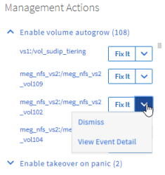

= Unified Manager 자동 수정을 사용하여 문제 해결
:allow-uri-read: 
:icons: font
:imagesdir: ../media/

[role="lead"]
Unified Manager에서 완벽하게 진단하고 단일 해결책을 제공할 수 있는 특별한 이벤트가 있습니다. 사용 가능한 경우 이러한 해결 방법은 Dashboard, Event Details 페이지 및 왼쪽 탐색 메뉴의 Workload Analysis 선택 항목에 표시됩니다.

== 이 작업에 대해

대부분의 이벤트는 이벤트 세부 정보 페이지에 표시될 수 있는 다양한 해결 방법이 있으므로 ONTAP System Manager 또는 ONTAP CLI를 사용하여 최상의 솔루션을 구현할 수 있습니다.

== 단계

. 대시보드 * 에서 수정할 수 있는 이벤트를 보려면 * 대시보드 * 를 클릭합니다.
+

. Unified Manager로 해결할 수 있는 문제를 해결하려면 * Fix it * 버튼을 클릭합니다.

